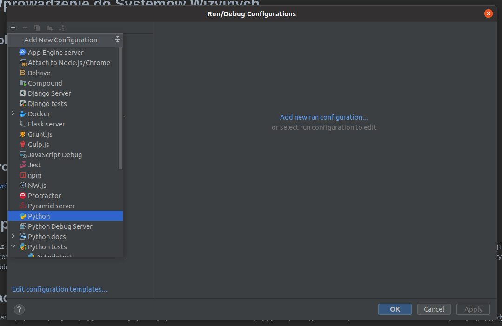

# Wprowadzenie do Systemów Wizyjnych

## Politechnika Poznańska, Instytut Robotyki i Inteligencji Maszynowej

<p align="center">
  
</p>

# **Projekt zaliczeniowy: zliczanie owoców**

Wraz z postępem technologicznym w obszarze sensorów wizyjnych wzrosło zapotrzebowanie na rozwiązania umożliwiające automatyzację procesów z wykorzystaniem wizyjnej informacji zwrotnej. Ponadto rozwój naukowy w zakresie algorytmów przetwarzania obrazu umożliwia wyciąganie ze zdjęć takich informacji jak ilość obiektów, ich rozmiar, położenie, a także orientacja. Jedną z aplikacji wykorzystujących przetwarzanie obrazu są na przykład bezobsługowe kasy pozwalające rozpoznać i zliczyć produkty, które znajdują się w koszyku.

## Zadanie

Zadanie projektowe polega na przygotowaniu algorytmu wykrywania i zliczania owoców znajdujących się na zdjęciach. Dla uproszczenia zadania w zbiorze danych występują jedynie 3 rodzaje owoców:
- jabłka
- banany
- pomarańcze

Wszystkie zdjęcia zostały zarejestrowane "z góry", ale z różnej wysokości. Ponadto obrazy różnią się między sobą poziomem oświetlenia oraz oczywiście ilością owoców.

Poniżej przedstawione zostało przykładowe zdjęcie ze zbioru danych i poprawny wynik detekcji dla niego:

```bash
{
  ...,
  "07.jpg": {
    "apple": 2,
    "banana": 1,
    "orange": 1
  },
  ...
}
```

<p align="center">
  
</p>

## Struktura projektu

Szablon projektu zliczania owoców na zdjęciach dostępny jest w serwisie [GitHub](https://github.com/PUTvision/WDPOProject) i ma następującą strukturę:

```bash
.
├── data
│   ├── 00.jpg
│   ├── 01.jpg
│   └── 02.jpg
├── readme_files
├── detect_fruits.py
├── README.md
└── requirements.txt
```

Katalog [`data`](./data) zawiera przykłady, na podstawie których w pliku [`detect_fruits.py`](./detect_fruits.py) przygotowany ma zostać algorytm zliczania owoców. Funkcja `main` w pliku `detect_fruits.py` powinna pozostać bez zmian. 


### Wywyołanie programu

Skrypt `detect_fruits.py` przyjmuje 2 parametry wejściowe:
- `data_path` - ścieżkę do folderu z danymi (zdjęciami)
- `output_file_path` - ścieżkę do pliku z wynikami

```bash
$ python3 detect_fruits.py --help

Options:
  -p, --data_path TEXT         Path to data directory
  -o, --output_file_path TEXT  Path to output file
  --help                       Show this message and exit.
```

W konsoli systemu Linux skrypt można wywołać z katalogu projektu w następujący sposób:

```bash
python3 detect_fruits.py -p ./data -o ./results.json
```

W środowisku PyCharm możliwe jest dodanie parametrów wejściowych do skryptu, z którymi program będzie wywoływany każdorazowo przy uruchomieniu. W tym celu należy otworzyć okno konfiguracji z górnego menu `Run > Edit Configurations...`. W otwartym oknie konfiguracji poprzez symbol `+` należy dodać nową konfigurację dla języka Python. Tworzonej konfiguracji należy nadać nazwę, uzupełnić ścieżkę do pliku `detect_fruits.py` oraz uzupełnić ścieżki do parametrów wejściowych skryptu zgodnie z powyższym opisem oraz ostanim rysunkiem.

<p align="center">
  
</p>
<p align="center">
  
</p>
<p align="center">
  
</p>
